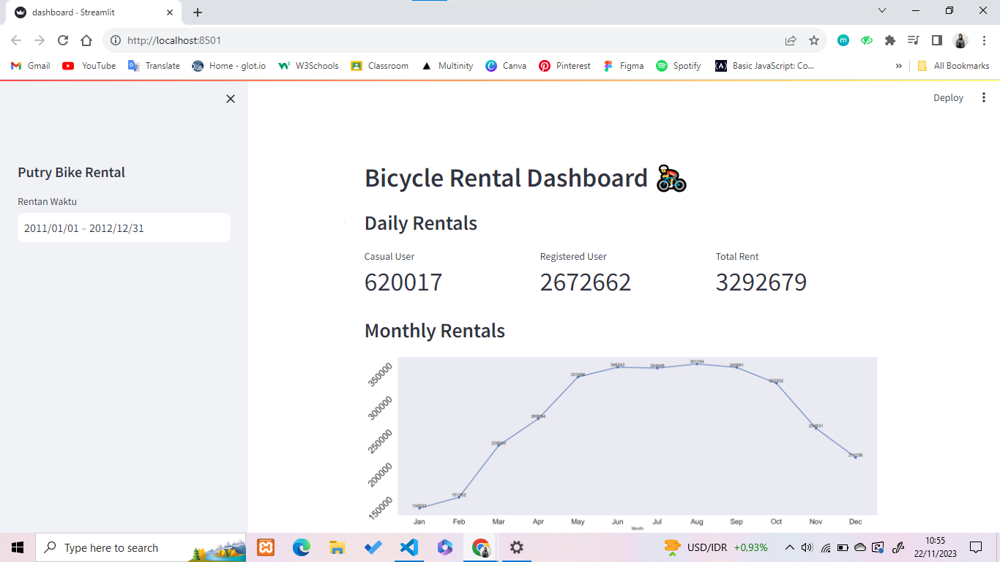
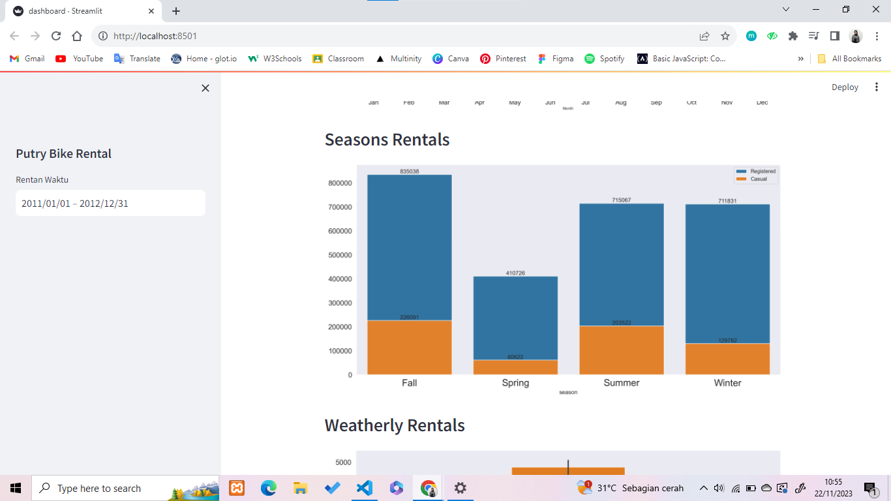
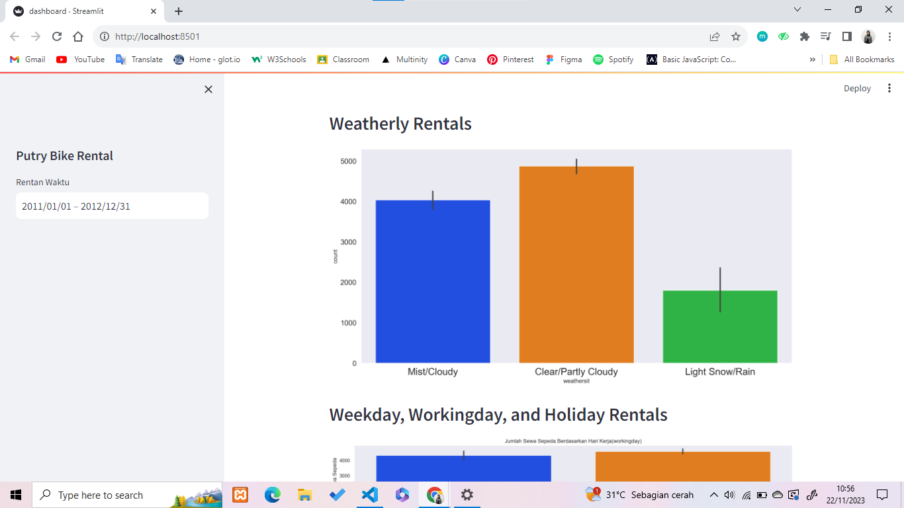
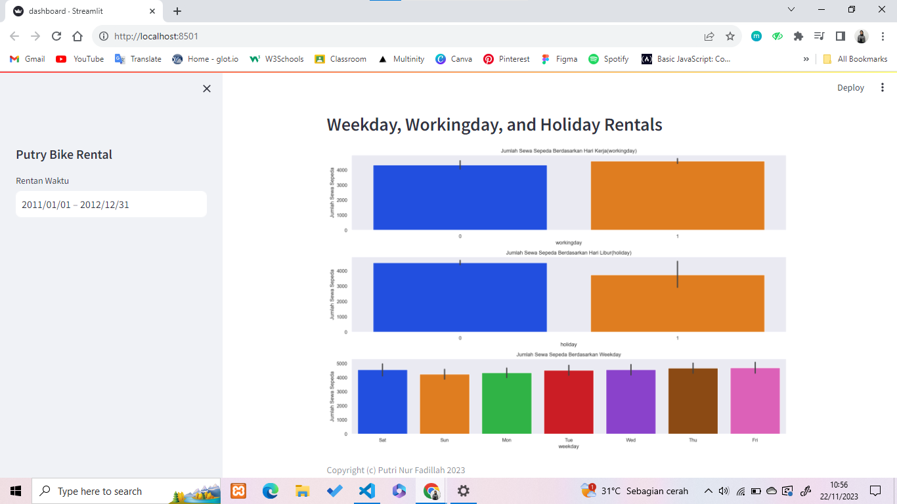

# Bike-Rentals--Project-Akhir-Data-Analisi-Dicoding

## Run Steamlit app
`streamlit run dashboard.py`

## Setup envioenment
`conda create --name main-ds python=3.9`
`conda activate main-ds`
`pip install pandas matplotlib seaborn jupyter streamlit`

## Screenshot

## Link streamlit app
https://bike-rentals-projec-akhir-dicoding.streamlit.app/
